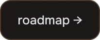
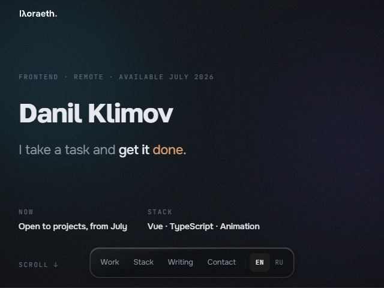
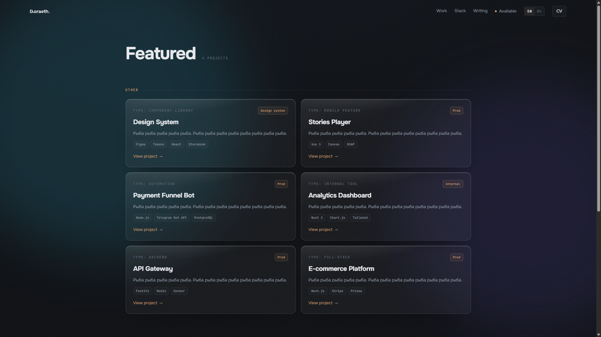
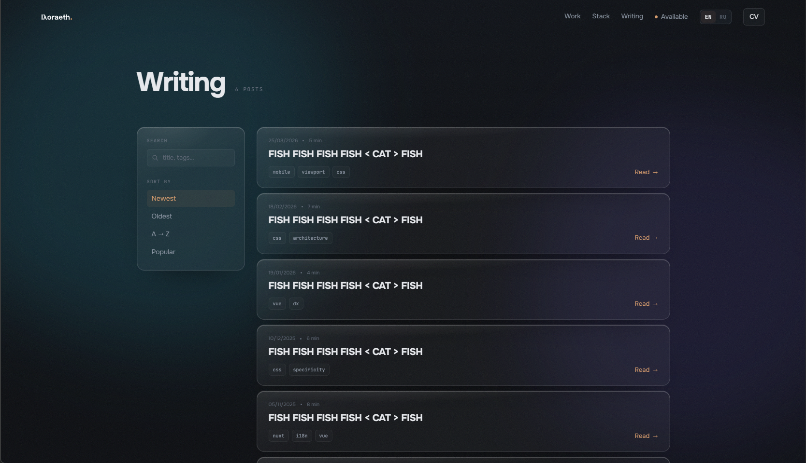
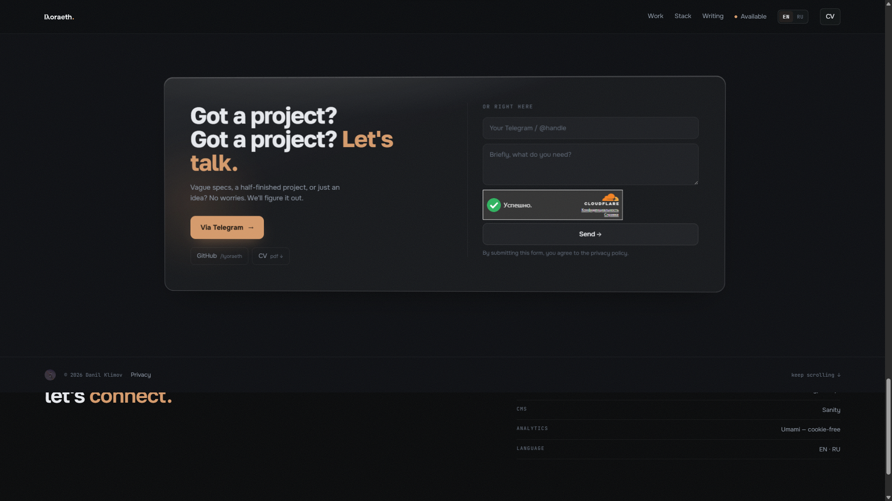

# lyoraeth.art

Personal site — work, writing, contact. The site itself is the demo.

<a href="https://lyoraeth.art"></a>&nbsp;&nbsp;<a href="ROADMAP.md"></a>

---

| | |
|:---:|:---:|
|  |  |
|  |  |
|  |  |

---

## What it is

Ninth iteration. First one built on a real brief, a design system, and a stack chosen for reasons.

The concept is **atmospheric minimalism** — dark stage, blurred color primitives in the background, glass layers in the middle, sharp type up front. Volume through light and blur, not shadows on buttons.

EN / RU. Self-hosted analytics. Full CI/CD. Deploys on push.

---

## Stack

| Technology | Purpose |
| :--- | :--- |
| **Nuxt 4** | SSR, file-based routing, Nitro server |
| **Vue 3** | Composition API throughout |
| **Tailwind CSS v4** | Utility-first, reads design tokens from CSS variables |
| **Sanity** | Headless CMS — work items and writing posts |
| **@nuxtjs/i18n** | EN / RU, `prefix_except_default`, cookie-persisted locale |
| **Lenis** | Smooth scroll, client-side only |
| **Resend** | Contact form email delivery |
| **Cloudflare Turnstile** | Invisible CAPTCHA — no fingerprinting, no tracking cookies |
| **Umami** | Self-hosted analytics — cookie-free, no third parties |
| **Docker + GitHub Actions** | Multi-stage build, GHCR, SSH deploy on push to main |

---

## Design

### Concept
Background: large blurred color blobs in `oklch`. Middle layer: glass panels. Front: sharp type. Dark mode only.

### Glass
Four properties, one `.glass` utility in `tokens.css`:

- `backdrop-filter: blur(24px) saturate(160%)`
- `background: oklch(100% 0 0 / 4%)`
- `box-shadow: inset 0 1px 0 oklch(100% 0 0 / 12%)`
- `::after` with a linear gradient — top-edge catch light

Used on cards, nav, modals, and the contact panel.

### Logo
Designed in Figma, exported as SVG. Prepared in all required formats: `favicon.ico`, `favicon-16/32.png`, `apple-touch-icon.png`, `site.webmanifest`. Inlined in the nav to inherit `currentColor`.

### Typography
Three typefaces, three jobs. **Golos Text** — body and UI, neutral and highly legible. **Onest** — headings, a bit more character. **JetBrains Mono** — tags, labels, metadata — anything that needs to read as a code artifact. All three are self-hosted via `@nuxtjs/google-fonts` with `download: true`, so there are zero external font requests in production.

---

## How it's built

### Design system
All design tokens — color, spacing, radius, easing, blur — are CSS custom properties in `tokens.css`. Tailwind reads them via `@theme inline`. Components read them directly. No magic numbers anywhere in the codebase.

Every transition duration and animation is a token (`--dur-base`, `--ease-out-expo`, etc.). A single `@media (prefers-reduced-motion: reduce)` block sets them all to zero — no conditional logic scattered across components.

### Motion
Scroll reveals and entrance transitions run on `IntersectionObserver` — no scroll event listeners, no layout thrashing. Lenis takes over smooth scroll on desktop and is initialized client-side only so SSR stays clean.

Reading progress bar on post pages — a passive `scroll` listener updates shared `useState`, rendered as a 1.5px ember line at the bottom of the nav. Activates only on `writing/[slug]`, resets and cleans up on unmount.

Table of contents on post pages — headings are extracted from the raw Markdown at render time and turned into anchor links (`slugify` on h2/h3 text, injected via a custom `marked` renderer). On desktop (≥1152px) the TOC renders as a `position: fixed` sidebar to the right of the content without shifting the layout. On tablet/mobile it collapses into a button in the nav bar that opens a glass dropdown. Active section is tracked with a passive scroll listener comparing heading positions against a reading-line at 50% of viewport height. TOC always includes Introduction (everything before the first heading), any post headings, and appends Sources and Comments as visually separated entries at the bottom.

### SSR and hydration
The server renders complete, readable HTML. Anything that touches `window`, `document`, or pointer events lives in `onMounted` or a `.client`-suffixed plugin. Vue's hydration never sees a mismatch because the client picks up exactly where the server left off.

### CMS (Sanity)
Work items and writing posts are managed in Sanity Studio. Content is fetched server-side via GROQ queries inside Nitro API routes — the Sanity token never leaves the server. Images go through Sanity's CDN transformation pipeline: the server builds `?w=&fm=webp&q=` URLs, the component renders a `<picture>` with WebP → JPEG fallback.

Post bodies are written in Markdown — stored as a plain `text` field in Sanity, fetched as a string via GROQ, and parsed on the frontend with `marked`. The custom renderer wraps images in `<figure>` and adds `target="_blank"` to external links. Posts support a structured `references` array (title + URL) rendered as a numbered footer below the body.

Comments on writing posts are stored in Sanity and fetched client-side with a public read token. Writes go through a Nitro endpoint that validates Turnstile before calling Sanity's mutation API.

### Performance
- Fonts: self-hosted, `font-display: swap`, preloaded — zero render-blocking external requests
- Images: WebP via Sanity CDN (`?fm=webp`), `loading="lazy"` everywhere except above-the-fold covers; cover dimensions pulled from Sanity asset metadata and passed as explicit `width`/`height` — zero CLS. AVIF was dropped after CDN pre-hydration failures caused broken `<picture>` fallback chains in SSR.
- Static assets (avatar, logo, favicons): `Cache-Control: public, max-age=31536000, immutable`
- Stage background: `contain: layout style paint` — GPU-isolated layer, no reflow from blob animation
- JS: SSR-first — the page is readable before any script runs; Lenis and observers are progressive enhancement
- Work cards: `loading="eager"` on all card images (above-the-fold section); `/api/work` response cached for 5 minutes server-side
- Analytics: Umami script is a single lightweight beacon, no tracking cookies, no external calls
- Server-Timing: a Nitro plugin hooks into `request` and `beforeResponse` to emit an `app;dur=` metric — visible in DevTools → Network → Timing, no overhead in production

### Security
All routes carry `Strict-Transport-Security` (preload), `Cross-Origin-Opener-Policy: same-origin`, `X-Frame-Options: DENY`, and `Permissions-Policy` explicitly disabling camera, microphone, geolocation, payment, USB, Bluetooth, and interest-cohort.

A `Content-Security-Policy-Report-Only` header is in place with a verified allowlist. Violations are collected by `POST /api/csp-report` and delivered as email alerts via Resend — no third-party reporting service. The header will be promoted to enforced `Content-Security-Policy` once the report stream confirms the allowlist is complete.

`GET /api/health` returns `{"ok":true}` unconditionally — used as the Docker `HEALTHCHECK` target (interval 30 s, timeout 5 s, start-period 10 s).

Well-known security files are served as static assets: `/.well-known/security.txt` (with PGP signature), `/pgp-key.txt`, and `/humans.txt`. Vulnerability disclosure policy is documented in [SECURITY.md](SECURITY.md) — 72 h acknowledgment, 14-day resolution target.

Rate limiting on `POST /api/comment` and `POST /api/contact` is enforced at the nginx level via `limit_req_zone` (10 req/min per IP, burst 5, `nodelay`). Requests beyond the burst cap receive 429 before reaching the application. The zone definition lives in nginx-proxy-manager's `http.conf` custom include; the `limit_req` directives are applied per-location in NPM's Advanced tab.

Browser compatibility: every `oklch()` and `color-mix()` value is preceded by an `rgba()` fallback — the cascade ensures older engines get a valid color without any visual degradation.

### SEO and discoverability
- `useSeoMeta` on every page — `og:title`, `og:description`, `og:image`, `twitter:card`
- JSON-LD `Person` schema on the homepage; `BlogPosting` schema (headline, datePublished, image, author) on each post
- Dynamic `sitemap.xml` generated by a Nitro route, cached for 24 h
- `llms.txt` with structured site description and real Markdown links for AI crawlers
- `llms-full.txt` — dynamic Nitro route that fetches all work and writing from Sanity at request time and renders them as plain text. Post bodies are already Markdown strings — included as-is. Cached for 1 h with `stale-while-revalidate`. Always up to date — no build-time generation step needed.
- WebMCP `send_message` tool registered on the page — AI agents can submit the contact form programmatically without scraping

### Contact form
`POST /api/contact` — Nitro endpoint. Validates Turnstile server-side, calls Resend SDK. No SMTP, no separate mail server. If Turnstile fails, the request is rejected before anything is sent.

### Comments
`POST /api/comment` — stores a nickname + message in Sanity with `approved: false`. Email is never requested or stored — only the handle the user chooses. Turnstile-gated.

On successful write, Resend sends an email with the comment text and an **Approve** button. The button links to `GET /api/comment/approve?id=…&token=…`, where the token is an HMAC-SHA256 of the Sanity document ID signed with the Sanity write token. The endpoint verifies the token with `timingSafeEqual`, patches `approved: true` via the Sanity client, and returns a minimal HTML confirmation page. No Sanity Studio interaction required for moderation.

`GET /api/comments/[slug]` — returns only `approved: true` comments for a given post slug.

### Legal
Privacy policy and personal data consent (152-ФЗ, separate document since 01.09.2025) are static Markdown files parsed at build time with `marked`. No CMS dependency for legal pages.

### i18n
Two locales, `prefix_except_default` — `/` for EN, `/ru/` for RU. Browser language detected on first visit, stored in `i18n_locale` cookie. All internal navigation uses `localePath()` — no hardcoded routes.

### CI/CD
Push to `main` → GitHub Actions: multi-stage Docker build → push to GHCR → SSH into VPS → pull, restart, prune. ~3 minutes from push to live. The VPS runs nginx-proxy-manager for SSL termination — no custom nginx config.

### DNS and network
Cloudflare is used as DNS only (gray cloud, no proxy). The VPS is hosted at Sprinthost, St. Petersburg — a Russian IP range. Routing traffic through Cloudflare's proxy made the site inaccessible in Russia without a VPN, since Cloudflare's IP ranges are blocked by Roskomnadzor. DNS-only keeps all Cloudflare configuration intact (rules, SSL settings, etc.) while resolving the domain directly to the VPS IP, which is reachable from within Russia.

---

## Dev

```bash
pnpm install
pnpm dev          # localhost:3000
```

Copy `.env.example` → `.env`, fill in Sanity project ID, Turnstile keys, Resend API key.

```bash
pnpm build
pnpm preview
```

---

## Structure

```
app/
  components/         # SiteNav, SiteFooter, sections/*, WorkCard, post/*
  pages/              # index, work/[slug], writing/[slug]
                      # privacy (EN/RU), personal-data (RU — 152-ФЗ consent)
  assets/
    css/              # main.css (tokens + global styles)
    content/          # privacy.en.md, privacy.ru.md, personal-data.ru.md
i18n/locales/
  en.json  ru.json
server/
  api/                # contact.post, comment.post, comment/approve.get
                      # comments/[slug].get, csp-report.post, health.get
                      # work.get, work/[slug].get, post/[slug].get
                      # rating/*, settings.get, status.get, mcp/send.post
  routes/             # sitemap.xml.ts, llms-full.txt.ts
  utils/              # Sanity client, image formatter
.github/workflows/
  deploy.yml
Dockerfile
docker-compose.yml    # app + umami + umami-db
```

---

## Author

**Danil Klimov**
- GitHub: [@lyoraeth](https://github.com/lyoraeth)
- Telegram: [@lyoraeth](https://t.me/lyoraeth)

---

## License

Source Reference License — the code is publicly available for study and reference only.
Copying code, design, content, locale strings, or legal documents is not permitted.
See [LICENSE](LICENSE) for the full terms.
