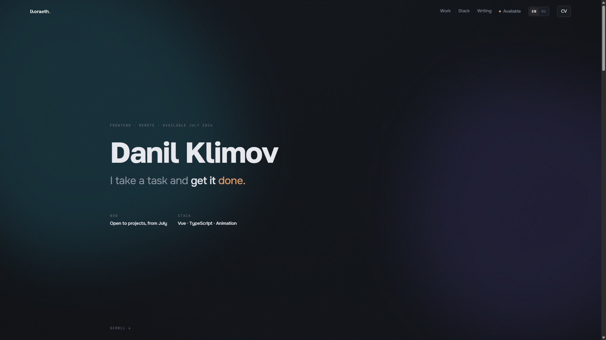
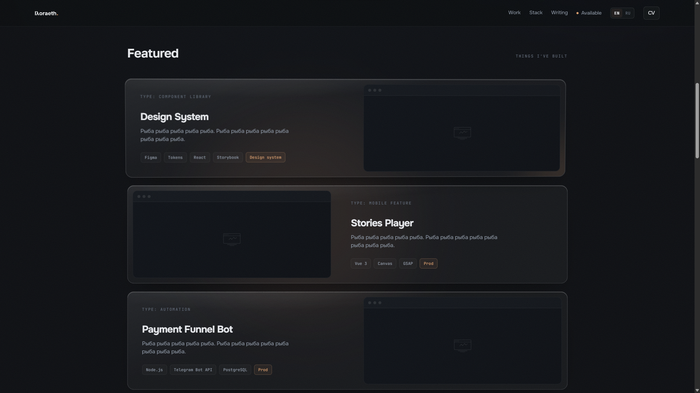

# lyoraeth.art

Personal site — work, writing, contact. The site itself is the demo.

**→ [lyoraeth.art](https://lyoraeth.art)**

---

| | |
|:---:|:---:|
|  |  |
|  |  |
|  | |

---

## What it is

Ninth iteration. First one built on a real brief, a design system, and a stack chosen for reasons.

The concept is **atmospheric minimalism** — dark stage, blurred color primitives in the background, glass layers in the middle, sharp type up front. Volume through light and blur, not shadows on buttons.

EN / RU. Self-hosted analytics. Full CI/CD. Deploys on push.

---

## Stack

| Technology | Purpose |
| :--- | :--- |
| **Nuxt 4** | SSR, file-based routing, Nitro server |
| **Vue 3** | Composition API throughout |
| **Tailwind CSS v4** | Utility-first, reads design tokens from CSS variables |
| **Sanity** | Headless CMS — work items and writing posts |
| **@nuxtjs/i18n** | EN / RU, `prefix_except_default`, cookie-persisted locale |
| **Lenis** | Smooth scroll, client-side only |
| **Resend** | Contact form email delivery |
| **Cloudflare Turnstile** | Invisible CAPTCHA — no fingerprinting, no tracking cookies |
| **Umami** | Self-hosted analytics — cookie-free, no third parties |
| **Docker + GitHub Actions** | Multi-stage build, GHCR, SSH deploy on push to main |

---

## Design

### Concept
The visual language has three depth planes. Deep in the background — large, heavily blurred color blobs (`oklch`, because sRGB doesn't interpolate through grey). In the middle — glass panels. Up front — sharp typographic content under hard directional light. The result reads as spatial without a single drop shadow or bevel.

Dark mode only. Not a trend choice — the atmospheric depth only works on a dark field. Light mode would flatten everything.

### Glass
The glass effect is the load-bearing visual detail of the whole design, so it got obsessive treatment. The recipe:

- `backdrop-filter: blur(24px) saturate(160%)` — the frosted base
- `background: oklch(100% 0 0 / 4%)` — a hint of white to catch the light
- `box-shadow: inset 0 1px 0 oklch(100% 0 0 / 12%)` — inner top highlight, simulates the physical edge of glass
- `::after` pseudo-element with a linear gradient — the specular catch light, the fine line that makes it read as a surface rather than a rectangle

All four ingredients are defined as a single `.glass` utility in `tokens.css`. Used identically on cards, nav, modals, and the contact panel — the light behaves consistently everywhere.

### Logo
Designed in Figma. The mark is a geometric construction — no stock, no font-based wordmark. From Figma it was exported as SVG and then prepared across every required format: `favicon.ico` (multi-size), `favicon-16.png`, `favicon-32.png`, `apple-touch-icon.png` (180×180), and `site.webmanifest` with the full icon set. The SVG version is inlined in the nav so it inherits `currentColor` and responds to any future theme changes without touching the asset.

### Typography
Three typefaces, three jobs. **Golos Text** — body and UI, neutral and highly legible. **Onest** — headings, a bit more character. **JetBrains Mono** — tags, labels, metadata — anything that needs to read as a code artifact. All three are self-hosted via `@nuxtjs/google-fonts` with `download: true`, so there are zero external font requests in production.

---

## How it's built

### Design system
All design tokens — color, spacing, radius, easing, blur — are CSS custom properties in `tokens.css`. Tailwind reads them via `@theme inline`. Components read them directly. No magic numbers anywhere in the codebase.

Every transition duration and animation is a token (`--dur-base`, `--ease-out-expo`, etc.). A single `@media (prefers-reduced-motion: reduce)` block sets them all to zero — no conditional logic scattered across components.

### Motion
Scroll reveals and entrance transitions run on `IntersectionObserver` — no scroll event listeners, no layout thrashing. Lenis takes over smooth scroll on desktop and is initialized client-side only so SSR stays clean.

### SSR and hydration
The server renders complete, readable HTML. Anything that touches `window`, `document`, or pointer events lives in `onMounted` or a `.client`-suffixed plugin. Vue's hydration never sees a mismatch because the client picks up exactly where the server left off.

### CMS (Sanity)
Work items and writing posts are managed in Sanity Studio. Content is fetched server-side via GROQ queries inside Nitro API routes — the Sanity token never leaves the server. Images go through Sanity's CDN transformation pipeline: the server builds `?w=&fm=avif&q=` URLs, the component renders a `<picture>` with AVIF → WebP → JPEG fallback chain.

Comments on writing posts are stored in Sanity and fetched client-side with a public read token. Writes go through a Nitro endpoint that validates Turnstile before calling Sanity's mutation API.

### Performance
- Fonts: self-hosted, `font-display: swap`, preloaded — zero render-blocking external requests
- Images: AVIF/WebP via Sanity CDN, `loading="lazy"` everywhere except above-the-fold covers, explicit `width`/`height` to prevent layout shift
- JS: SSR-first — the page is readable before any script runs; Lenis and observers are progressive enhancement
- Analytics: Umami script is a single lightweight beacon, no tracking cookies, no external calls

### Contact form
`POST /api/contact` — Nitro endpoint. Validates Turnstile server-side, calls Resend SDK. No SMTP, no separate mail server. If Turnstile fails, the request is rejected before anything is sent.

### i18n
Two locales, `prefix_except_default` — `/` for EN, `/ru/` for RU. Browser language detected on first visit, stored in `i18n_locale` cookie. All internal navigation uses `localePath()` — no hardcoded routes.

### CI/CD
Push to `main` → GitHub Actions: multi-stage Docker build → push to GHCR → SSH into VPS → pull, restart, prune. ~3 minutes from push to live. The VPS runs nginx-proxy-manager for SSL termination — no custom nginx config.

---

## Dev

```bash
pnpm install
pnpm dev          # localhost:3000
```

Copy `.env.example` → `.env`, fill in Sanity project ID, Turnstile keys, Resend API key.

```bash
pnpm build
pnpm preview
```

---

## Structure

```
app/
  components/         # SiteNav, SiteFooter, sections/*, shared UI
  pages/              # index, work/[slug], writing/[slug], privacy
  assets/css/         # tokens.css, main.css
i18n/locales/
  en.json  ru.json
server/
  api/                # contact.post.ts, work.get.ts, post/[slug].get.ts …
  utils/              # Sanity client, image formatter
.github/workflows/
  deploy.yml
Dockerfile
docker-compose.yml    # app + umami + umami-db
```

---

## Author

**Danil Klimov**
- GitHub: [@lyoraeth](https://github.com/lyoraeth)
- Telegram: [@lyoraeth](https://t.me/lyoraeth)

---

## License

MIT — the code is yours. Design, content, and visual identity are not covered.
