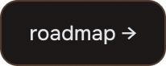
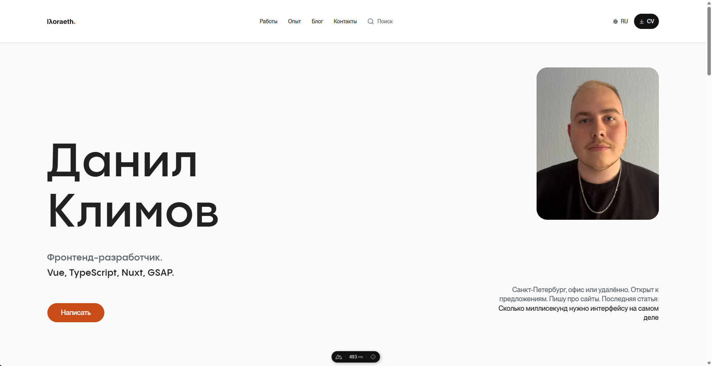
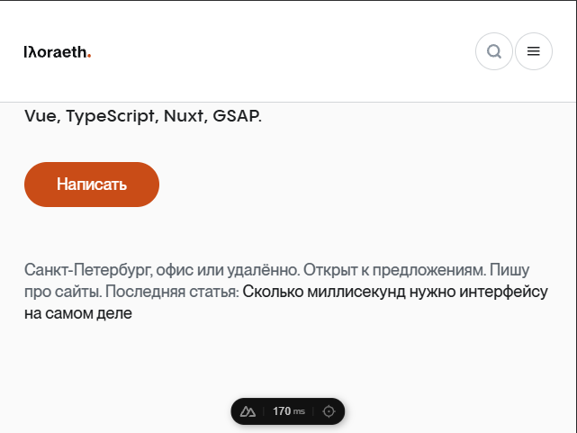
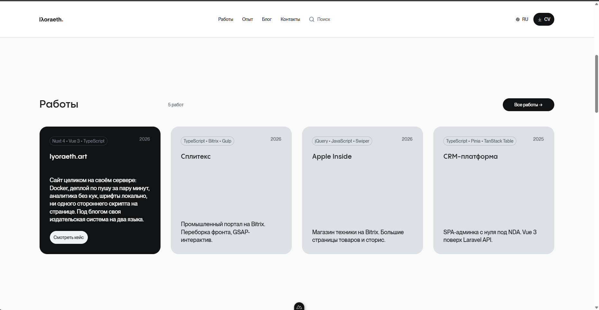
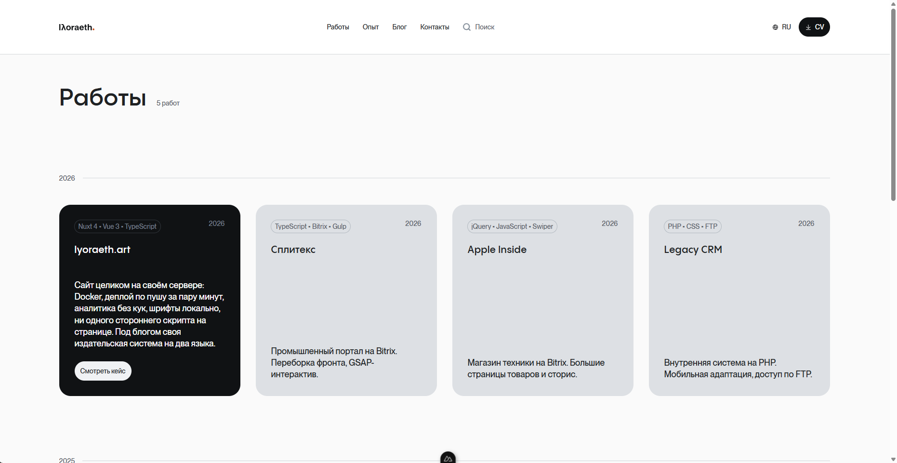
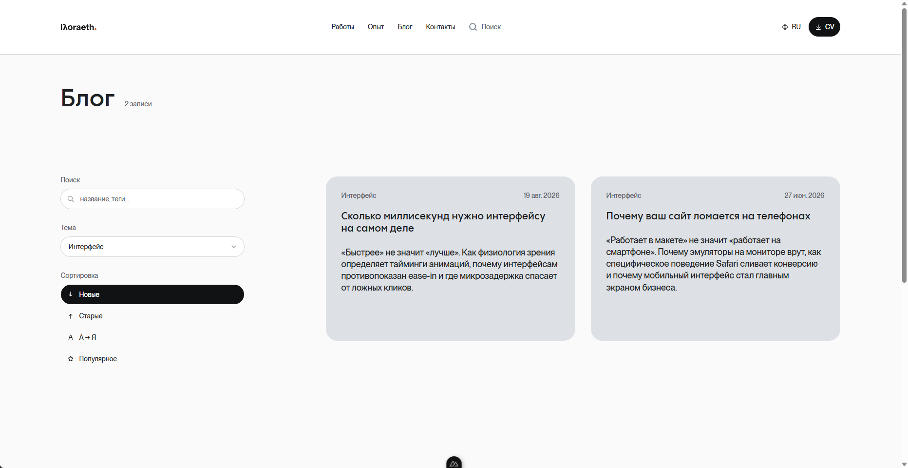
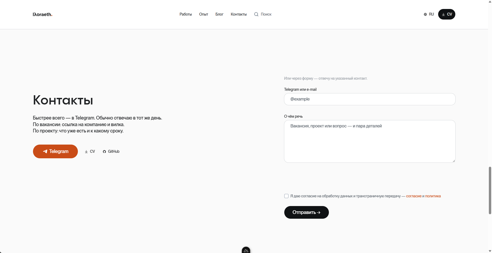

# lyoraeth.art

Personal site — work, writing, contact. The site itself is the demo.

<a href="https://lyoraeth.art"></a>&nbsp;&nbsp;<a href="ROADMAP.md"></a>

---

| | |
|:---:|:---:|
|  |  |
|  |  |
|  |  |

---

## What it is

Third redesign. One light theme, a 12-column grid, hairline dividers. Figma brief, a design-token system, SSR-first.

EN / RU. Cookieless analytics. Self-hosted media and fonts. CI/CD, deploys on push.

---

## Stack

| Technology | Purpose |
| :--- | :--- |
| **Nuxt 4** | SSR, file-based routing, Nitro server |
| **Vue 3** | Composition API throughout |
| **Tailwind CSS v4** | Utility-first, reads design tokens from CSS variables (`@theme static`) |
| **Sanity** | Headless CMS — work items, posts, site settings; the Studio lives in `studio/` |
| **@nuxtjs/i18n** | EN / RU, `prefix_except_default`, cookie-persisted locale |
| **marked** | Markdown post bodies, with a custom renderer |
| **satori + resvg** | Dynamic OG cards rendered server-side |
| **ffmpeg + libjxl** | The image pipeline — jxl / avif / webp / jpg, encoded on the server |
| **Resend** | Contact-form and comment-approval email |
| **Cloudflare Turnstile** | Invisible CAPTCHA — no fingerprinting, no tracking cookies |
| **Umami** | Self-hosted analytics — cookie-free, no third parties |
| **Docker + GitHub Actions** | Multi-stage build, GHCR, SSH deploy on push to `main` |

---

## Design

One light theme, no dark mode. Content on a plain surface split by 1px dividers; sections and cards on a 12 → 8 → 4 column grid. `sm` is off — no 640px step. No background layers, grain or glass.

Two typefaces, self-hosted: **PP Neue Montreal** (Medium) for body and UI, **PP Pangram Sans** (Semibold) for display. The woff2 files are licensed and kept out of the repo, served from `/fonts/` by nginx outside Nuxt — no external font requests in production.

The logo is a Figma SVG, inlined in the header to inherit `currentColor`, with `favicon.ico`, `favicon-16/32.png`, `apple-touch-icon.png`, `site.webmanifest` and theme-aware SVG favicons prepared alongside.

---

## How it's built

### Design tokens
Everything — colour, spacing, radius, type scale, motion — is a CSS custom property in `assets/css/design-system.css`, declared in a `@theme static` block so Tailwind keeps them even when a scoped component style is the only consumer. Components read them directly; there are no magic numbers.

Colours are `oklch` with a hex fallback: an `@supports not (color: oklch(0 0 0))` block outside `@layer theme` redeclares the palette, so an engine without `oklch` gets a valid colour with no visual degradation.

### Motion
Durations and curves are set from the physiology of vision rather than by feel — the reasoning is a post on the site, *How Many Milliseconds an Interface Actually Needs*. One `--ease-out` curve for everything, with `--ease-in` (its point-reflection) for elements that leave the screen. The base pair is `--duration-hover: 180ms` and `--duration-press: 90ms`; larger movements have their own tokens, and page transitions run longer on touch (`@media (pointer: coarse)`). One `prefers-reduced-motion` block in the shell flattens every animation and transition to instant.

Scrolling is the browser's own — nothing intercepts wheel or touch. Anchor jumps use `scroll-behavior` and `scroll-padding-top`. Scroll-triggered reveals (the writing listing) run on `IntersectionObserver`.

### Cards
The whole card is the click target, with no stretched link over it — the real link is on the heading, the card forwards the pointer gestures a link honours. Text stays selectable: a drag selects, a plain click opens, ctrl/⌘/middle-click opens a new tab, a click on body text waits out the double-click window. Hover states are behind `@media (hover: hover)` so a tap doesn't latch them; the hover fill is a `clip-path` circle grown from the pointer's entry point.

### Header, menu, search
Sticky header; below `lg` it collapses to a burger and a full-screen menu teleported to `body`. Search is a separate layer, mutually exclusive with the menu from both directions; Escape and outside clicks close the results dropdown before the menu. The search catalogue (work, posts, legal pages) is fetched once per session on first focus, filtered on the client after. While the menu — or a page's own lightbox — is open, `<main>` is `inert`, both sources combined into one flag via `provide`/`inject`.

### Maintenance notice
A strip above the header, shown only while `siteSettings.notice.enabled` is set — toggled from the CMS without a deploy. `html:has(.site-notice)` sets `--notice-h` while it's mounted; the sticky header and `scroll-padding-top` read `var(--notice-h, 0)` to clear it.

### Media pipeline
Images are uploaded to Sanity as-is; the site does not use Sanity's CDN transforms (no jxl, unreliable avif, softening at high quality). A scheduled Nitro task (`server/tasks/media/sync.ts`, every five minutes inside the app container) pulls each referenced original once and encodes the delivery variants: **jxl** via `cjxl` — progressive, first in the `<picture>` fallback order — and **avif / webp / jpg** via `ffmpeg`, each with hand-tuned settings. The task works to a per-run budget so a backlog of new covers spreads over ticks instead of pinning the CPU, and prunes variants whose source is no longer referenced.

Variants are written to `/media/{sha1}-{family}-{width}.{ext}` and served static with immutable caching. There are two families: `full` keeps the source ratio, `cover` is a 4:3 top-anchored crop the server produces so the narrow layout doesn't ship a whole full-page screenshot to render a strip of it. `SanityPicture.vue` builds the art-directed `<picture>`; if a variant hasn't been encoded yet, an `` error drops the `<source>`s and the raw Sanity URL takes over. The hero portrait stays a set of static files in `public/face/` — one photo, hand-compressed with different settings.

Post bodies can reference gallery images with `{fit=cover pos=top ar=16/9}` — a `marked` extension resolves the key against the post's `gallery` array and emits the same self-hosted `<picture>`.

### CMS (Sanity)
Work items and posts are edited in Sanity Studio (`lyoraeth.sanity.studio`, schema in `studio/schemaTypes/`); a `siteSettings` singleton holds the social handles, CV files and the maintenance-notice flag. Content is fetched server-side through GROQ inside Nitro API routes — the Sanity token never reaches the browser.

Post bodies are Markdown stored as plain text, parsed with `marked`. The custom renderer stamps anchor ids onto `h2`/`h3`, wraps images in `<figure>`, opens external links in a new tab, turns ` ```mermaid ` fences into diagram containers (mermaid itself is a dynamic import, only on posts that have one), and handles the `gallery:` scheme above. Posts also carry a `references` array (title + URL) rendered as a numbered footer.

Comments are stored in Sanity with `approved: false`. Writes go through a Nitro endpoint that verifies Turnstile first; on success Resend sends an email with the comment and an **Approve** link — `GET /api/comment/approve?id=…&token=…`, where the token is an HMAC-SHA256 of the document id signed with the Sanity write token, verified with `timingSafeEqual`. No Studio interaction needed to moderate. `GET /api/comments/[slug]` returns only approved comments.

### Table of contents
On a post, headings are pulled from the raw Markdown at render time and turned into anchor links (the same `slugify` the renderer stamps on `h2`/`h3`). From `80rem` up the TOC is a `position: sticky` sidebar in its own grid column; below that it's a plain, always-visible list inline in the article. Active section is tracked with a rAF-batched scroll listener. The list always opens with an Introduction entry (everything before the first heading) and appends Sources and Comments as separate entries.

### SSR and hydration
The server renders complete, readable HTML. Anything touching `window`, `document` or pointer events lives in `onMounted` or a `.client` plugin, so hydration never sees a mismatch. Every page component has a single element root — `<NuxtPage>` wraps it in `<Transition mode="out-in">`, and a Fragment root there leaves the incoming page unmounted on a client-side navigation.

### SEO and discoverability
- `useSeoMeta` on every page; canonical, `hreflang` alternates and `og:locale` come from the i18n routing config via `useLocaleHead`, so they stay correct across locale switches.
- JSON-LD: one `Person` node on the homepage with an `@id`; each post's `BlogPosting` and each case's `CreativeWork` reference it by id rather than repeating it, alongside `BreadcrumbList`. The writing index carries `Blog`.
- OG images: a page with a cover uses a size-capped JPEG off the Sanity CDN; a page without one gets a branded card rendered on the fly by `satori` + `resvg` (`server/routes/og/[type]/[slug]`, localised via `?l=`), with a fixed card for the homepage. The renderer caches a base64 string, not a `Buffer` — Nitro's cache layer serialises entries as JSON and mangles binary.
- Dynamic `sitemap.xml` (Nitro route, cached 24h); `rss.xml` per locale.
- `llms.txt` plus `llms-full.txt` — the latter a Nitro route that pulls all work and writing from Sanity at request time and renders them as plain text, cached 1h with `stale-while-revalidate`.
- A WebMCP `send_message` tool is registered on the page so an agent can submit the contact form without scraping.

### Performance
- Images: the pipeline above — modern formats, a width ladder, explicit `width`/`height` from Sanity asset metadata so there's no CLS. Covers load eager with `fetchpriority="high"`, everything else lazy.
- Fonts: self-hosted woff2, `font-display: swap` — no render-blocking external requests.
- Static assets carry `Cache-Control: public, max-age=31536000, immutable`.
- The page is server-rendered — readable before any script runs; observers are progressive enhancement.
- `/api/work` and a few other read endpoints are cached server-side via `defineCachedEventHandler`.
- Umami is a single lightweight beacon, no cookies, no external calls.
- A Nitro plugin emits a `Server-Timing: app;dur=` metric — visible in DevTools, no production overhead.

### Security
Every route carries `Strict-Transport-Security` (preload), `Cross-Origin-Opener-Policy: same-origin`, `X-Frame-Options: DENY`, and a `Permissions-Policy` disabling camera, microphone, geolocation, payment, USB, Bluetooth and interest-cohort.

A `Content-Security-Policy-Report-Only` header is in place with a verified allowlist; violations go to `POST /api/csp-report` and out as Resend email alerts — no third-party reporting service. It'll be promoted to enforced once the report stream confirms the allowlist.

`GET /api/health` returns `{"ok":true}` — the Docker `HEALTHCHECK` target (it hits `127.0.0.1`, not `localhost`: alpine resolves `localhost` to `::1` too and busybox `wget` tries IPv6 first, where node doesn't listen).

Well-known files are static: `/.well-known/security.txt` (PGP-signed), `/pgp-key.txt`, `/humans.txt`. Disclosure policy is in [SECURITY.md](SECURITY.md).

Rate limiting on `POST /api/comment`, `/api/contact` and `/api/mcp/send` is enforced at the nginx layer (`limit_req_zone`, per-location in nginx-proxy-manager's config). Requests past the burst cap get 429 before reaching the app.

### The rest of the server
- `POST /api/contact` — validates Turnstile server-side, sends via the Resend SDK. No SMTP, no mail server.
- `POST /api/mcp/send` — the same, for the WebMCP tool; no captcha (an agent can't solve one), so it's length-capped and rate-limited instead.
- `POST /api/rating/[slug]` — records an up/down vote, deduped per voter by a salted SHA-256 of IP + slug as the document id; the raw IP is never stored.
- Legal pages are Markdown in `app/assets/content/`, rendered through the same `marked` setup — no CMS dependency.

### i18n
Two locales, `prefix_except_default` — `/` for EN, `/ru/` for RU. Browser language is detected on first visit and stored in `i18n_locale`. All internal navigation goes through `localePath()`.

### CI/CD
Push to `main` → GitHub Actions: multi-stage Docker build → push to GHCR → SSH into the VPS → `docker compose pull && up -d`, prune, smoke-test. A few minutes from push to live. The VPS runs nginx-proxy-manager for SSL — no hand-written nginx config.

### DNS and network
Cloudflare is DNS-only (grey cloud, no proxy). The VPS is at Sprinthost in St. Petersburg, on a Russian IP range. Routing through Cloudflare's proxy made the site unreachable inside Russia without a VPN, since those ranges are blocked; DNS-only keeps the Cloudflare config while resolving straight to the VPS.

---

## Dev

```bash
pnpm install
pnpm dev          # localhost:3000
```

Copy `.env.example` → `.env` and fill in the Sanity project id, Turnstile keys and Resend key.

```bash
pnpm build
pnpm preview

pnpm lint
pnpm test         # vitest
pnpm test:e2e     # playwright
```

The media pipeline needs `ffmpeg` and `cjxl` on `PATH` for the sync task; the Docker image installs both.

---

## Structure

```
app/
  components/         # SiteHeader, PageFooter, SiteNotice, sections/*
                      # WorkCard, PostCard, SanityPicture, SearchResults, post/*
  composables/        # useSiteSearch, useMarkdown, useToc, useCardLink,
                      # useArticleSeo, useMainInert, mediaSrc, …
  pages/              # index, work/[slug], writing/[slug], listings,
                      # privacy (EN/RU), personal-data (RU — 152-ФЗ)
  assets/
    css/              # main.css (layer order), design-system.css (tokens)
    content/          # privacy.en.md, privacy.ru.md, personal-data.ru.md
shared/
  media.ts            # naming + width ladder shared by the pipeline and the client
i18n/locales/         # en.json  ru.json
server/
  api/                # contact, comment(+approve), comments/[slug], rating/*
                      # csp-report, health, mcp/send, work(+[slug]),
                      # post/[slug], posts, settings
  routes/             # sitemap.xml, rss.xml (+ru), llms-full.txt, og/*
  tasks/media/sync.ts # the scheduled image-encoding task
  routes/media/       # serves the encoded variants
  utils/              # Sanity client, media encoder, OG template
studio/               # Sanity Studio — schema, config, migration scripts
.github/workflows/deploy.yml
Dockerfile
docker-compose.yml    # app + umami + umami-db
```

---

## Author

**Danil Klimov**
- GitHub: [@lyoraeth](https://github.com/lyoraeth)
- Telegram: [@lyoraeth](https://t.me/lyoraeth)

---

## License

Source Reference License — the code is publicly available for study and reference only.
Copying code, design, content, locale strings, or legal documents is not permitted.
See [LICENSE](LICENSE) for the full terms.
